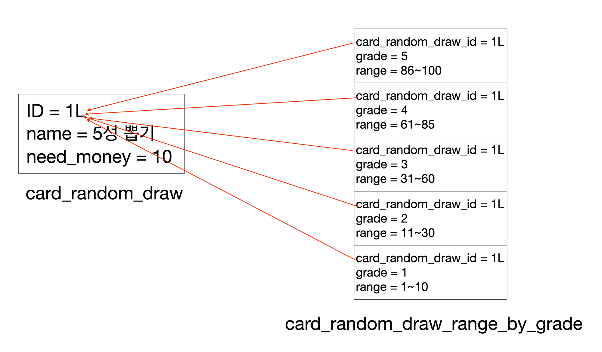

# 카드 랜덤 뽑기

## 구현 상세



1:N 구조를 나타내는 `card_random_draw_range_by_grade` 에는 별개 PK 가 존재하지 않는다.

`card_random_draw_range_by_grade` 1 row 로서는 비즈니스적으로 아무런 가치를 지니지 않고,  
`card_random_draw` 와 함께 다 같이 조회되었을 때 실질적으로 가치를 지니므로,  
생명주기를 `card_random_draw` 와 함께한다는 의미로 `@ElementCollection`, `@CollectionTable` 을 활용했다.

> `@ElementCollection`, `@CollectionTable` 에 대해서는 아래 글을 참고하자.  
> https://github.com/Hyeon9mak/WIL/blob/2e7a35895b85107b664fa44e5c3b9e57e85d51f9/jpa/jpa-value-type.md#%EA%B0%92-%ED%83%80%EC%9E%85-%EC%BB%AC%EB%A0%89%EC%85%98

또 하나 살펴볼 점은 `CardRandomDrawRangeByGrade` 에서 `@Embeddable` 어노테이션을 사용중인데,  
이 이유는 No-arg compiler-plugin 의 지원을 받기 위해서다.

<br>

## 동작

구체적으로 확률별 랜덤한 등급을 뽑기 코드는 아래와 같이 동작한다.

```kotlin
fun randomDrawGrade(): CardGrade {  
    val randomValue = (1..100).random()  
    return ranges.first { it.isInRange(randomValue) }.grade  
}
```
 
1. 1~100 사이의 난수를 뽑는다. 
2. 카드 랜덤 뽑기에 존재하는 확률 범위 중에서 난수에 해당되는 등급을 뽑아낸다.

```kotlin
val cardGrade = cardRandomDraw.randomDrawGrade()
val drewCards = cardRepository.findByGrade(grade = cardGrade)
val drewCard = drewCards.random()
return drewCard
```

1. 뽑아낸 등급을 기준으로 카드 저장소에서 같은 등급의 카드들을 모두 찾아낸다. 
2. 찾아낸 카드 리스트에서 랜덤한 한 장을 뽑아서 반환한다.

<br>

## 참고할 글

- [랜덤 뽑기(가챠) 시스템 구현하기 - 현구막 기술 블로그](https://hyeon9mak.github.io/lets-make-random-draw-system/)
- [마이 쿠키 서비스 탄생 비화 - 아이들나라 기술블로그](https://i-nara.oopy.io/ab11f099-e3d0-44d1-97a4-f389ace58709)
